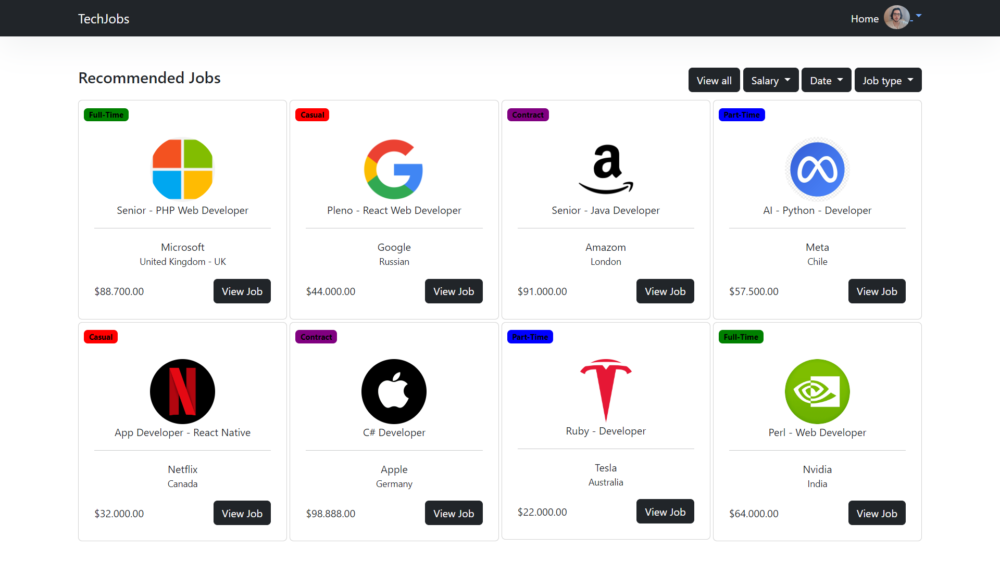

# Tech Jobs

O Tech Jobs é uma plataforma que oferece uma experiência completa tanto para pessoas em busca de emprego quanto para empresas que desejam contratar. Abaixo estão resumidas as principais funcionalidades do site:

https://github.com/MarcosMaio/Job-App/assets/120725100/aad39353-39c1-4be7-a1fd-b3199fbd4783

# Funcionalidades:

Para pessoas em busca de emprego:

Registro e confirmação por e-mail: Os usuários podem se cadastrar no sistema e receber um e-mail de confirmação para ativar suas contas.
Visualização de vagas: Na página principal, os usuários podem ver várias postagens de vagas, cada uma com título, imagem da empresa, localização, salário e tipo de contratação.
Filtragem de vagas: Os usuários podem filtrar os trabalhos por tipo de salário, vagas mais recentes ou mais antigas, entre outros critérios.
Visualização detalhada de vagas: Ao clicar em uma vaga, os usuários podem ver uma visualização completa com todas as informações relevantes sobre o trabalho e a empresa, além de poder se candidatar ao trabalho.
Perfil do usuário: Os usuários têm a opção de acessar seu perfil, onde podem adicionar ou alterar sua imagem de perfil, nome, senha e currículo, além de ver as vagas às quais se candidataram.

Para empresas em busca de funcionários:

Registro e confirmação por e-mail: As empresas podem se cadastrar no sistema e receber um e-mail de confirmação para ativar suas contas.
Dashboard da empresa: Após o login, as empresas têm acesso a um painel com várias funcionalidades, incluindo a adição, edição e exclusão de trabalhos postados.
Visualização de candidatos e trabalhos: As empresas podem ver todos os candidatos que se inscreveram para suas vagas, bem como todas as postagens de trabalho feitas pela empresa.
Seleção de candidatos: As empresas podem baixar currículos, escolher candidatos para avançar para a próxima fase do processo seletivo e enviar e-mails aos selecionados.
Planos de assinatura: As empresas podem escolher entre diferentes planos de assinatura (semanal, mensal, anual) para ter acesso a recursos adicionais, como postar mais vagas, através da integração com a API de pagamentos Stripe.

Em resumo, o Tech Jobs oferece uma plataforma abrangente que conecta pessoas em busca de emprego com empresas que estão contratando, fornecendo uma experiência simplificada e eficiente para ambos os lados.

# Tecnologias

- PHP
- Laravel
- JavaScript
- JQuery
- Bootstrap
- MySql
- SQL
- Sripe-Payments-Api
